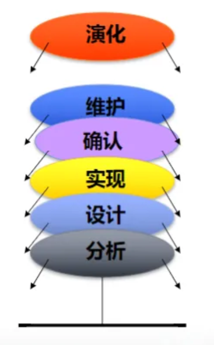
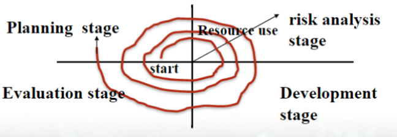

# 软件工程概论

软件的概念，有三层含义：
1. 个体含义，指计算机系统中的程序及文档
2. 整体含义，指计算机系统上的所有上述个体含义下软件的总称，或者指计算机系统中所有除硬件之外的所有成分
3. 学科含义，指在研究，开发，维护及使用前述含义下的软件所涉及的理论、方法、技术所构成的学科

软件工程的概念：
1. 软件工程是一类求解软件的工程，它应用计算机科学、数学及管理科学等原理，借鉴传统工程的原则、方法、创建软件以达到提高质量，降低成本的目的
2. 软件工程是一门指导计算机软件开发的学科和维护的工程学科

模型的概念：
+ 模型是在特定意图下所确定的角度和抽象层次上对物理系统的描述。通常包含系统边界描述，给出系统内各个元素和它们之间的语义关系。

<u>**软件开发的本质：**</u>

+ <u>**实现问题域中的概念和处理逻辑到运行平台的概念和处理逻辑的映射。**</u>

# 软件过程

<!-- 软件生存周期过程（按承担软件开发工作的主体的不同来分类）：
1. 基本过程
2. 支持过程
3. 组织过程

常见的软件生存模型，以及**各个模型的优缺点**：
1. 瀑布
2. 增量
3. 演化
4. 螺旋
5. 喷泉

软件项目生存周期的过程：
1. 选取一个适合项目的软件生存周期模型
2. 确定项目需要的过程、活动和任务
3. 配以适当的组织过程，让项目可以实施 -->

软件生存周期概念：
+ 软件产品或软件系统从产生、投入使用到被淘汰的全过程。通常将软件生存周期分为5个阶段，即需求、设计、实现（编码）、测试和维护。

软件生存周期模型（也称软件开发模型）概念：
+ 整个软件生存周期内的系统开发、运行和维护所实施的全部过程、活动和任务的框架。**表达的是软件生存周期内的各种活动如何组织，以及各个阶段应该如何衔接。**

<u>**软件过程的概念：**</u>
+ <u>**又称为软件生存周期过程。是软件生存周期中的一系列相关过程。过程是活动的集合，活动是任务的集合，任务是将输入加工成输出的操作。**</u>

<u>**软件过程按照不同人员的工作内容的分类：**</u>
1. <u>**基本过程，指那些与软件生产直接相关的过程，包括：**</u>
    + <u>**获取过程**</u>，是获取者（需方）所从事的活动和任务。目的是获得满足客户所要求的产品和服务。该过程从定义客户要求开始，以接受客户所要求的产品和服务结束。
    + <u>**供应过程**</u>，是供方为了向客户提供满足需求的软件产品或服务所从事的活动和任务。目的是向客户提供一个满足需求的产品或服务。
    + <u>**开发过程**</u>，是软件开发者所从事的活动和任务。目的是将一组需求转换为一个软件产品或系统。
    + <u>**运行过程**</u>，是系统操作者所从事的活动和任务。目标是在软件产品预期的环境中运行改产品，并为软件产品的维护提供支持。
    + <u>**维护过程**</u>，是维护者所从事的活动和任务。目的是对于交付后的系统或软件产品，纠正其错误，改进其性能或其他属性而对其进行修改；或因环境变更，对其进行调整。
2. <u>**支持过程，指有关各方按他们支持目标所从事的一系列相关活动集**</u>，包括8个过程（理解即可）：
    + 文档过程
    + 配置管理过程
    + 质量保证过程
    + 验证过程
    + 确认过程
    + 联合评审过程
    + 审计过程
    + 问题解决过程
3. <u>**组织过程，指那些与软件生产组织有关的过程**</u>，包括7个过程（了解即可）：
    + 管理过程
    + 基础设施过程
    + 改进过程
    + 人力资源过程
    + 资产管理过程
    + 复用程序管理过程
    + 领域软件工程过程

<u>**软件开发模型的概念：**</u>
+ <u>**软件开发模型是软件开发的全部过程、活动和任务的结构框架。软件开发模型能够清晰、直观地表达软件开发的全部过程，明确规定要完成的主要活动和任务，它用来作为软件项目工作的基础。**</u>
   + <u>**外征：软件开发活动的组织**</u>
   + <u>**内涵：求解软件的计算逻辑**</u>

<u>**软件过程和软件开发模型的区别？**</u>
+ <u>**软件过程：系统化地给出了软件开发所需要的任务**</u>
+ <u>**软件开发模型：如何根据软件项目特点和环境因素等，选择并组织这些开发任务。**</u>

常见的软件开发模型：
1. 瀑布模型
   + 假设：各项活动被规定为依固定顺序链接的若干阶段工作，每一阶段都有规定的输入、工作成果和传到下一阶段的输出。
   + 流程：项目开发经过需求、设计、编码、单元测试、集成和维护的路径，并且有反向步骤。
   + 优点：鼓励设计前的需求规约、对系统结构的设计，在每一阶段结束前的复审允许获取方和用户的参与，允许基线和配置早期受控。
   + 缺点：用户必须准确表达需求，开发人员必须理解需求，灵活性不足，过分强调基线的文档，开发完成才能运行风险大。
   + 适用情况：需求已经被很好地定义和理解，并且设计人员也很清楚开发实现这一模型所需要的过程
2. 增量模型
   + 假设：需求是可以分段为若干增量，并且每一个增量可以分别开发。
   + 流程：增量模型是瀑布模型的变体，它对每个增量分别开发。
   + 优点：除瀑布模型的所有优点外，第一个可交付版本所需的成本小，开发风险小，允许增量投资
   + 缺点：如果使用不当，可能会导致：初始增量造成后来增量的不稳定，之前的增量可能需要重新开发，管理成本、进度和配置的复杂性可能会超过组织的能力
   + 适用情况：开始开发时，需求很明确，并且产品可以适当地分解为一些独立的、可交付的软件，并且也希望尽快在开发过程中就提交一些增量产品。
3. 演化模型
   + 流程：由一些小的开发步骤组成，每一个步骤经过需求、设计、实现、验证的过程，产生软件的一个增量。 
    开发从获取核心需求并开发出核心系统开始。在完成一个的增量之后，根据用户的反馈意见，进行下一次的需求捕获和迭代开发。
   + 优点：和增量模型相似，但还有：可以在需求不能予以归约的时候使用，用户可以通过已经运行的系统对需求进行改进。
   + 缺点：演化模型需要有力的管理，很容易称为不编写需求或设计文档的借口，用户可能不理解演化模型，从而抱怨开发过程中得到产品不够理想
   + 使用情况：针对事先不能完整地定义需求的软件开发。
4. 喷泉模型
   + 流程：分析、设计、实现、维护等一系列迭代过程是无缝衔接且相互重叠的，各个开发阶段没有次序要求，可以交互进行，随时补漏。
   
5. 螺旋模型
   + 流程：该模型将软件生存周期的活动分为四个可重复的阶段：规划、风险分析、开发和评估
   

<u>**各个软件开发模型的差异**</u>

<u>**例1：瀑布模型和喷泉模型的区别**</u>
+ <u>**瀑布模型的阶段与阶段之间有比较明显的先后次序，并且后一阶段严格依赖于前一阶段的输入。而喷泉模型阶段与阶段之间没有次序要求，可以交互进行，随时补漏。**</u>

<u>**例2：演化模型和增量模型的区别**</u>
+ <u>**增量模型的增量是在开始开发的时候就确定的，而演化模型的增量是在开发的过程中逐步确定的。**</u>
+ <u>**演化模型中强调开发的每一个小步骤中都要经过需求、设计、实现、验证的过程。**</u>
+ <u>**演化模型的不断演化过程需要用户的反馈，而增量模型的所有需求都是在开发之前都已经确定的，只是实现有先后次序而产生了增量。**</u>

# 软件需求和软件需求规约

需求的定义：
+ 一个需求是一个有关”要予构造“的陈述，描述了待开发产品/系统的

需求发现技术：
+ 自悟
+ 交流，开发人员和用户交流
+ 观察，开发人员观察用户行为
+ 小组会，客户和开发人员的会议
+ 提炼，根据以往经验和文档，提取信息

软件需求规约的定义
+ 从需求中去除二义性等，形成正式的文档

软件需求规约的性质：
+ 重要性和稳定性程度
+ 可修改
+ 完整的
+ 一致的（不互斥）

**需求的分类：（给定需求确定属于哪个类别）**
1. **功能需求**
2. **各个非功能需求**

**设计约束，质量属性**

**需求的五个基本性质**
1. **必要的**
2. **无歧义的**
3. **可测的，指对给定的输入会有既定的输出**
4. **可跟踪的，从一个阶段到另一个阶段都是要有转化的踪迹的**
5. **可测量的，需要定量而非定性的描述**

**需求规约的作用**
1. **作为软件开发组织和用户之间的技术合同书**
2. **对于项目的大多数工作，是一个管理控制点**
3. **设计的正式，受控的起始点**
4. 

**项目需求关注的是交付给用户的产品是什么，软件需求规约关注项目工作和管理**

# 结构化分析方法

需求分为三个阶段：需求获取，需求分析和需求验证

需求验证的任务是保证需求规约的正确性。

结构化分析过程：
1. 确定系统边界，画系统环境图
2. 自顶向下，画各层的数据流图
3. 数据字典
4. 加工小说明（叶子节点即可）
5. 汇总

**要求能画数据流图，给出数据字典和加工小说明**

# 结构化设计

<!-- 总体设计：将数据流图转化为模块结构图

详细设计：内容 -->

变换性，事务性数据流图，**分别如何转化到模块结构图**

模块和耦合的定义，类型

**详细设计工具：框图，N-S图等，以及详细设计工具之间的转换**

# 面向对象方法

类和对象的概念，体现了数据的抽象

类图中类和对象的画法，普通属性和静态属性的画法，可见性和类型的画法，多重性

操作的画法，普通操作和静态操作

接口的画法，供接口和虚接口

协作，用况，主动类，构件，制品，节点

类目之间的关系：关联，泛化，实现，依赖（类之间的关系实际上刻画的是对象之间的关系）

两个类之间如果相互交互，但又不是依赖关系，就可以认为是关联关系。关联关系还要进一步确定是否是聚合或组合关系。关联要说明多重性。依赖是唯一的描述类目之间的（依赖）行为的关系。

顺序图的定义、作用和画法（详见总复习课件，比原课件详细）

状态图的画法的定义、作用和画法。

活动图的定义，活动图强调的是活动之间的控制图，描述的是系统业务过程和操作的算法。活动图的画法。

**UML的各种类目和关系的定义，它们的画法。针对一个简单的问题，能够建立对应的图。**

# 面向对象分析

**OOA的过程（结合课件）**
1. **发现对象，定义类**
2. **识别对象的内部特征**
3. **识别对象的外部关系**
4. **给出系统的顺序图，状态图，活动图等**

# 面向对象设计

OOD模型的四个组成部分：
1. 问题域部分
2. 人机交互
3. 控制驱动
4. 数据管理

# 软件测试

测试和调试的区别

测试过程模型

路径测试技术，控制流程图（白盒）和事务流程图（黑盒）的概念，各种覆盖的概念。

<!-- 事物流测试技术 -->

测试步骤，以及每一个阶段的任务，测试计划是什么时候形成的：
1. 单元测试
2. 集成测试
3. 有效性测试
4. 系统测试

# 软件工程项目管理概述

项目管理的四大核心：范围，时间，成本，质量。四大辅助领域：人力资源管理，风险管理……

了解CMM五级模型

# 软件维护、再工程和软件质量

软件维护的分类，各自适用场景

软件维护，正向和逆向工程，软件质量分类

# 代码风格和编码规范

防御式编程

代码风格
+ 命名风格
+ 注释风格
+ ……

